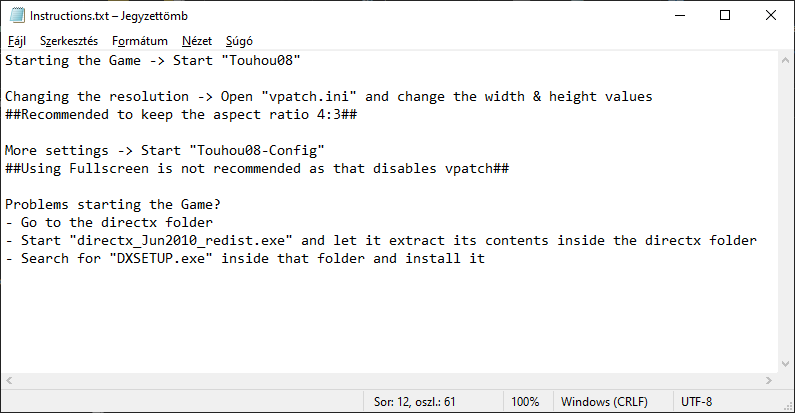
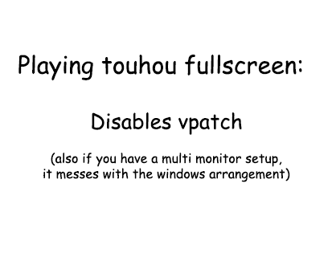
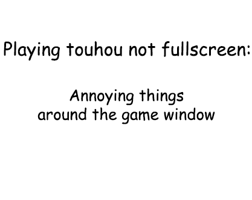
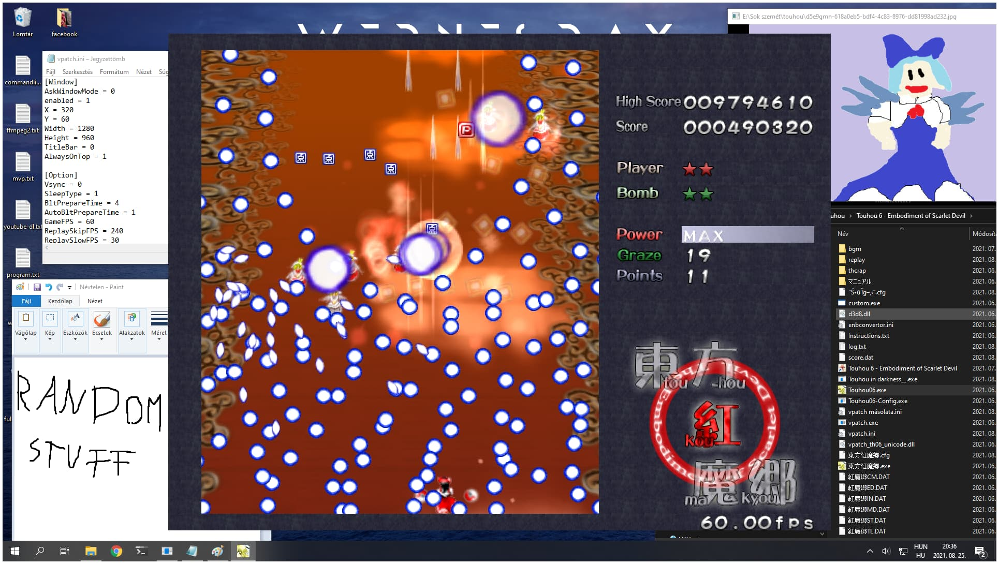
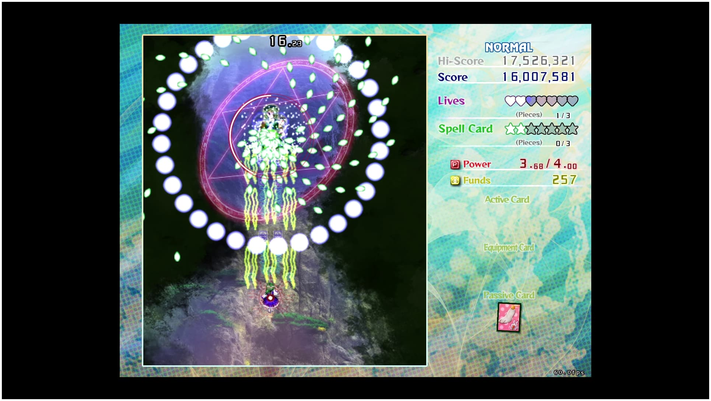
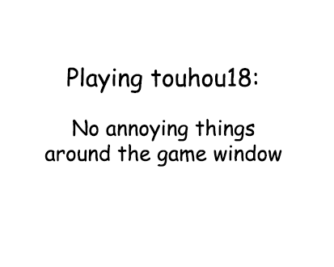
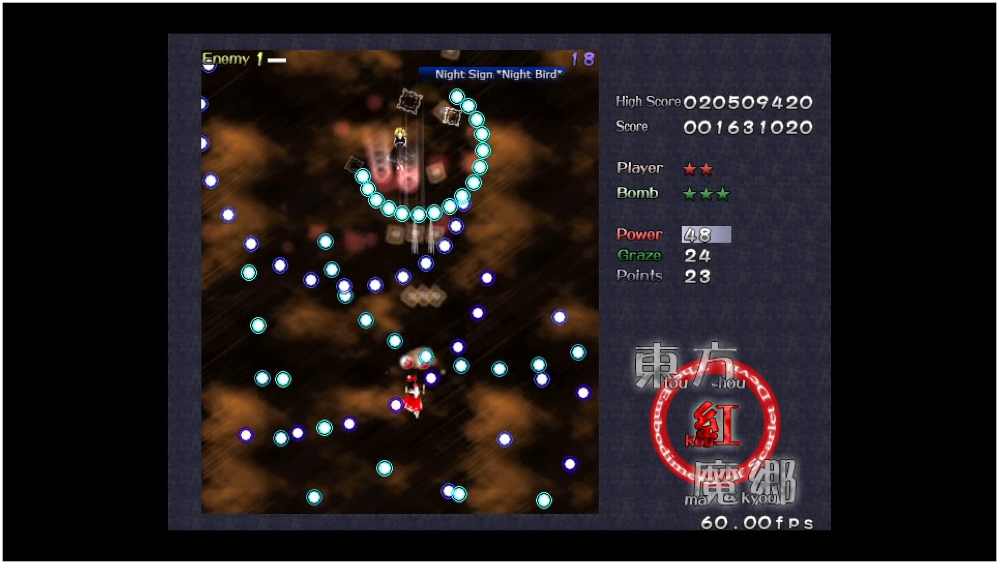
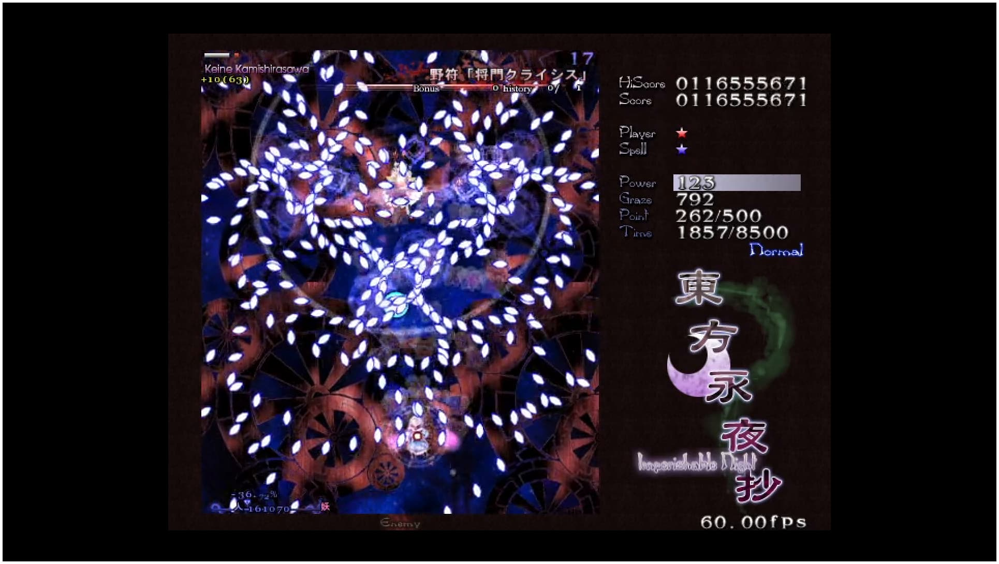

# Touhou in darkness

 

 
 
 

 

 
 
 

 

 
 
 
 

  

  
  
   
   
  
  
   
   
   

  

   
   

  

 
 
 
 

# How can I use this?
Just download the exe from [Releases](https://github.com/Vadgoblin/test/releases) and copy to the game folder.
The program looks for "Touhou??.exe". The patched game exe should be named that by default.
And that’s it. Just run the "Touhou in darkness.exe" and enjoy the game.

# Not working? (and About the project)
Create an [issue](https://github.com/Vadgoblin/readmetest/issues). I can’t promise I will answer.
I originally made that program for myself, but I thought, maybe there are other people having the same issue, so I decided to make it "good enough" (not hardcode but make more universal for example) so I can upload on GitHub. I hope people will find it and use it. If for some reason it actually become popular, I might add more features to it.
 If you can and want to change something in the code, the source code is available so you can do it.

This program work on my machine. Because I don't have multiple computers I can't test on other machines. I don't have any friend who play touhou, so it's also not an option to ask them to test on their machines.